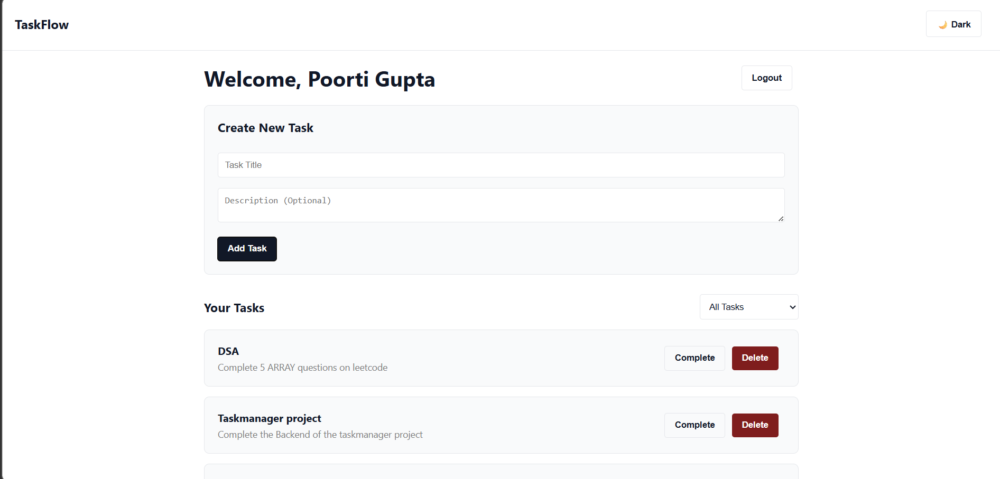
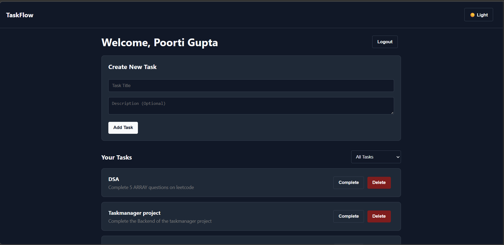

# TaskFlow

TaskFlow is a professional, full-stack task management application designed to help users efficiently organize, track, and manage their daily work. Built with a focus on simplicity and productivity, the platform features a secure user login system ensuring data isolation—meaning users only see and manage their own tasks. The interface utilizes a clean, monochrome aesthetic with a seamless CSS-based light/dark mode toggle, providing a distraction-free environment for task management.

---

## 📸 Screenshots

### Light Mode Interface

### Dark Mode Interface

---

## 🚀 Tech Stack

**Frontend:**
- **React.js** (Bootstrapped via Vite for fast compilation)
- **React Router DOM** (For seamless page navigation)
- **React Context API** (For global state and authentication management)
- **Pure CSS** (For custom monochrome styling and theme toggling)

**Backend:**
- **Python 3**
- **Flask** (Lightweight WSGI web application framework)
- **Flask-SQLAlchemy** (ORM for database interactions)
- **Flask-Migrate** (Alembic-based database migration management)

**Database:**
- **PostgreSQL** (Robust, open-source relational database)

**Other Tools & Libraries:**
- **Node.js & npm** (Package management)
- **python-dotenv** (Environment variable management)
- **Marshmallow / JSON** (Data serialization)

---

## 📡 API Endpoints Reference

The backend exposes a clean RESTful API to communicate with the frontend client.

| Method | Endpoint | Description | Payload Required |
| :--- | :--- | :--- | :--- |
| **GET** | `/api/users/` | Retrieves a list of all registered users. | None |
| **POST** | `/api/users/` | Registers a new user to the database. | `{"username": "str", "email": "str"}` |
| **GET** | `/api/tasks/` | Retrieves all tasks. *(Frontend filters by user_id)* | None |
| **POST** | `/api/tasks/` | Creates a new task assigned to a specific user. | `{"title": "str", "description": "str", "user_id": int}` |
| **PUT** | `/api/tasks/<id>` | Updates a task's status (e.g., mark as completed). | `{"is_completed": bool}` |
| **DELETE**| `/api/tasks/<id>` | Permanently deletes a task from the database. | None |

---

## 🔮 Future Implementations

To further enhance the productivity capabilities of TaskFlow, the following features are planned for future development:

- **Task Deadlines & Due Dates:** Allow users to assign specific calendar dates and times to tasks to better prioritize their workflow.
- **Email/Push Notifications:** Implement an automated alert system to notify users of approaching deadlines or overdue tasks.
- **Task Categories & Tags:** Enable users to group tasks into custom categories (e.g., "Work," "Personal," "Urgent") for improved sorting.
- **JWT Authentication:** Upgrade the simulated session management to full JSON Web Tokens (JWT) for enterprise-grade security and secure route protection.
- **Drag-and-Drop Kanban Board:** Introduce a visual board layout where users can drag tasks between "To Do," "In Progress," and "Done" columns.

## 🧠 Key Technical Decisions

* **Application Factory Pattern:** Instead of a single global Flask app, the backend uses a factory function (`create_app()`) to instantiate the application. This ensures clean separation of concerns and makes the app highly scalable and testable.
* **Blueprint Routing:** API routes are modularized using Flask Blueprints (`/api/users`, `/api/tasks`) to prevent routing bottlenecks as the application grows.
* **Vite Proxying:** To prevent Cross-Origin Resource Sharing (CORS) errors during development, the Vite frontend is configured to proxy all `/api` requests directly to the Flask backend, keeping the architecture secure and unified.
* **CSS Variables for Theming:** Implemented a pure-CSS light/dark mode toggle using a `data-theme` attribute and CSS variables, avoiding the overhead of heavy third-party UI libraries for a cleaner, faster interface.